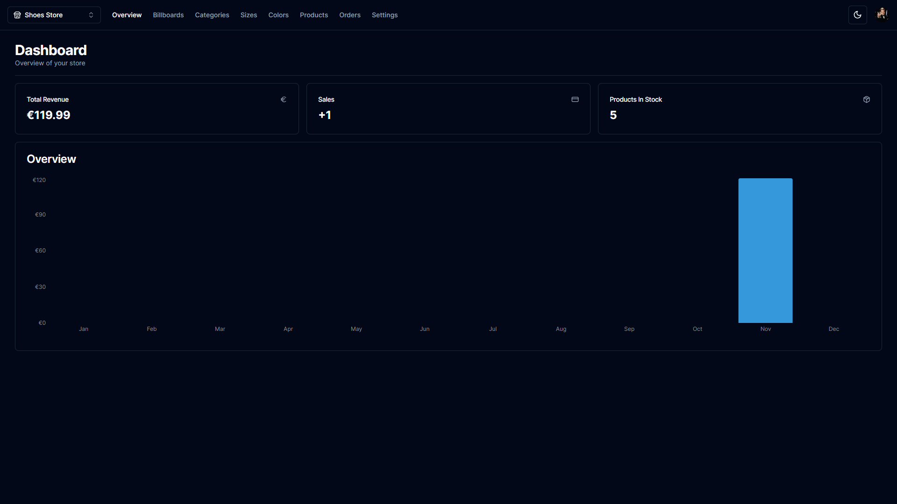
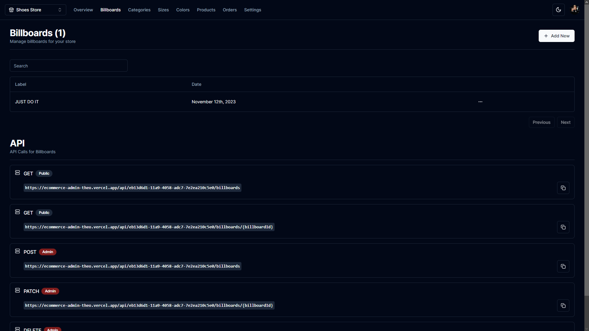
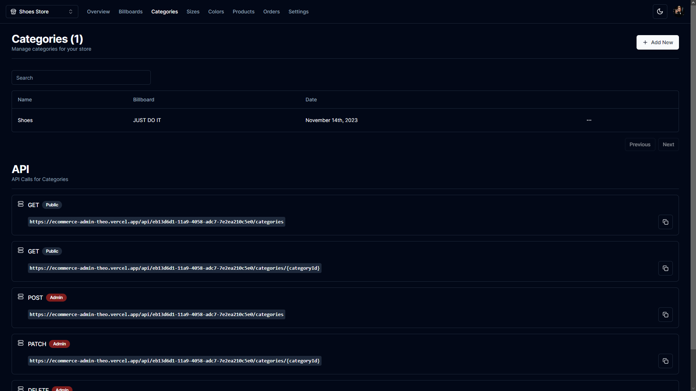
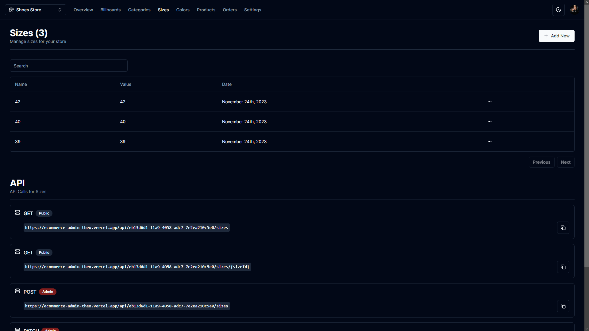
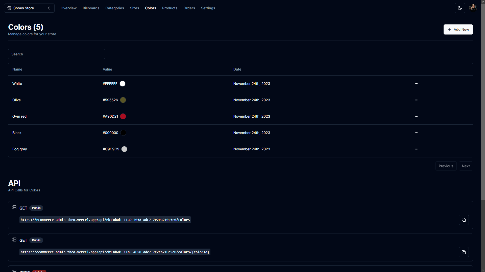
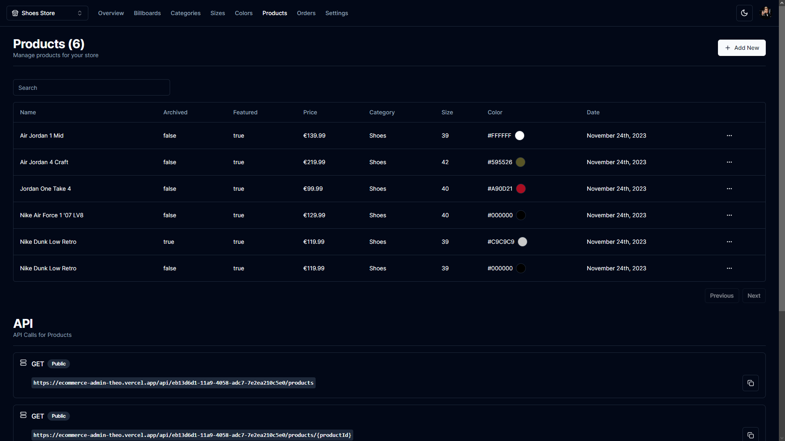

<div align="center">
<h1 align="center">

<br>ecommerce-admin
</h1>
<h3>◦ Streamline your eCommerce with ecommerce-admin!</h3>
<h3>◦ Developed with the software and tools listed below.</h3>

<p align="center">


</p>


</div>

---

## 📖 Table of Contents

- [📖 Table of Contents](#-table-of-contents)
- [📍 Overview](#-overview)
- [📦 Features](#-features)
- [⚙️ Modules](#-modules)
- [🚀 Getting Started](#-getting-started)
  - [🔧 Installation](#-installation)
  - [🤖 Running ecommerce-admin](#-running-ecommerce-admin)
- [🤝 Contributing](#-contributing)
- [📄 License](#-license)

---

## 📍 Overview

The project is an admin dashboard for managing an e-commerce store, built using Next.js and React. This powerful tool serves as a CMS, admin interface, and API, providing extensive control over multiple vendors and stores. The admin dashboard is designed with Shadcn UI for a sleek and user-friendly experience. It empowers administrators to efficiently handle categories, products, filters, billboards, and more, all while offering seamless integration with Clerk Authentication and Stripe payment functionalities.

---

## 📦 Features

|     | Feature                     | Description                                                                                                                                                                           |
| --- | --------------------------- | ------------------------------------------------------------------------------------------------------------------------------------------------------------------------------------- |
| 🌐  | **Shadcn UI**               | Experience a sleek and intuitive admin interface with Shadcn UI, providing a seamless and enjoyable experience for managing your eCommerce store.                                     |
| 🔄  | **CMS, Admin, and API Hub** | Utilize the dashboard as a centralized hub for Content Management, Admin tasks, and API management. Easily control multiple vendors and stores through a single, efficient interface. |
| 🗂️  | **Category Management**     | Create, update, and delete categories effortlessly. This feature enables you to organize and classify products with ease.                                                             |
| 📦  | **Product Management**      | Take full control of your product listings. Create, update, and delete products, upload multiple images for each product, and dynamically manage your inventory.                      |
| 🔄  | **Dynamic Filters**         | Define and manage filters such as "Color" and "Size" dynamically. Link these filters to products for a seamless user experience in product search and selection.                      |
| 🚀  | **Billboard Management**    | Create, update, and delete Billboards – prominent texts on top of the page. Attach them to specific categories or use them standalone.                                                |
| 🔍  | **Advanced Search**         | Implement a sophisticated search feature with pagination. Easily search through categories, products, sizes, colors, and billboards for efficient management and navigation.          |
| ⭐  | **Featured Products**       | Highlight specific products by marking them as "featured," ensuring they prominently appear on the homepage for increased visibility.                                                 |
| 📊  | **Sales Analytics**         | Access detailed graphs and analytics for revenue, sales, and other crucial metrics. Gain insights into the performance of your eCommerce store to make informed decisions.            |
| 🔐  | **Clerk Authentication**    | Implement secure authentication using Clerk, ensuring robust user account security and data privacy.                                                                                  |
| 📝  | **Order Management**        | Efficiently handle order creation and processing through the intuitive admin interface. Keep track of your orders seamlessly.                                                         |
| 💳  | **Stripe Integration**      | Enable secure transactions with integrated Stripe checkout. Manage Stripe webhooks for real-time updates and enhance the payment experience for both you and your customers.          |
| 🗃️  | **Database with Prisma**    | Leverage the power of MySQL and Prisma for a robust database setup.                                                                                                                   |

<div align="center">
  
  
</div>

<div align="center">
  
  
</div>

<div align="center">
  
  
</div>

---

## ⚙️ Modules

<details closed><summary>Root</summary>

| File                                                                                                                                                                  | Summary                                                                                                                                                                                                                                                                                                                                                                                                                                                                                                                                                                                                                               |
| --------------------------------------------------------------------------------------------------------------------------------------------------------------------- | ------------------------------------------------------------------------------------------------------------------------------------------------------------------------------------------------------------------------------------------------------------------------------------------------------------------------------------------------------------------------------------------------------------------------------------------------------------------------------------------------------------------------------------------------------------------------------------------------------------------------------------- |
| [middleware.ts](https://github.com/TheoEwzZer/ecommerce-admin/blob/main/middleware.ts)                                                                                | The code implements authentication middleware for Next.js. It enforces authentication for all routes except public routes specified. Configuration options allow custom routing patterns for non-public routes.                                                                                                                                                                                                                                                                                                                                                                                                                       |
| [next.config.js](https://github.com/TheoEwzZer/ecommerce-admin/blob/main/next.config.js)                                                                              | This code configures Next.js to enable using remote images from the specified Cloudinary hostname via HTTPS protocol.                                                                                                                                                                                                                                                                                                                                                                                                                                                                                                                 |
| [postcss.config.js](https://github.com/TheoEwzZer/ecommerce-admin/blob/main/postcss.config.js)                                                                        | This code exports a configuration object which defines two plugins: tailwindcss and autoprefixer. These plugins enable the tailwindcss framework and automatically add vendor prefixes to CSS properties, respectively.                                                                                                                                                                                                                                                                                                                                                                                                               |
| [tailwind.config.js](https://github.com/TheoEwzZer/ecommerce-admin/blob/main/tailwind.config.js)                                                                      | This code exports a Tailwind CSS configuration object that defines various theme and styling settings. It includes configuration for dark mode, content paths, container styling, color palette, animation effects, and plugins.                                                                                                                                                                                                                                                                                                                                                                                                      |
| [tailwind.config.ts](https://github.com/TheoEwzZer/ecommerce-admin/blob/main/tailwind.config.ts)                                                                      | This code exports a Tailwind CSS config object that specifies the project's content files, extends the theme with custom background images, and does not include any plugins.                                                                                                                                                                                                                                                                                                                                                                                                                                                         |
| [get-graph-revenue.ts](https://github.com/TheoEwzZer/ecommerce-admin/blob/main/actions\get-graph-revenue.ts)                                                          | This code retrieves monthly revenue data for a specific store by querying the database for paid orders and their associated products. It calculates the revenue for each order, aggregates it by month, and returns the data in a predefined format for use in a graph.                                                                                                                                                                                                                                                                                                                                                               |
| [get-sales-count.ts](https://github.com/TheoEwzZer/ecommerce-admin/blob/main/actions\get-sales-count.ts)                                                              | This code retrieves the count of paid orders for a specific store from the Prismadb database. It returns the sales count as a promise of a number.                                                                                                                                                                                                                                                                                                                                                                                                                                                                                    |
| [get-stock-count.ts](https://github.com/TheoEwzZer/ecommerce-admin/blob/main/actions\get-stock-count.ts)                                                              | This code fetches the stock count of products in a specified store using the prismadb library, by counting the products that belong to the given store and are not archived.                                                                                                                                                                                                                                                                                                                                                                                                                                                          |
| [get-total-revenue.ts](https://github.com/TheoEwzZer/ecommerce-admin/blob/main/actions\get-total-revenue.ts)                                                          | The code retrieves paid orders with their associated items and products from a database. It calculates the total revenue by summing up the prices of all the products in each order. The final result is returned as a number.                                                                                                                                                                                                                                                                                                                                                                                                        |
| [globals.css](https://github.com/TheoEwzZer/ecommerce-admin/blob/main/app\globals.css)                                                                                | This code uses Tailwind CSS to define color variables for various UI elements. It also applies base styles to HTML and body tags, and adds a dark mode variant.                                                                                                                                                                                                                                                                                                                                                                                                                                                                       |
| [layout.tsx](https://github.com/TheoEwzZer/ecommerce-admin/blob/main/app\layout.tsx>)                                                                                 | This code is responsible for creating the root layout of the application. It sets up providers for themes, toast notifications, and modal dialogs. It also integrates with Clerk for authentication. The layout includes global CSS styles and styling for the Inter font. Overall, it establishes the foundation for the admin dashboard.                                                                                                                                                                                                                                                                                            |
| [loading.tsx](https://github.com/TheoEwzZer/ecommerce-admin/blob/main/app\loading.tsx>)                                                                               | The code defines a React component called "Loading" that displays a loader animation in the center of the screen. It imports the "Loader" component for the animation and returns a styled div element wrapping the loader component.                                                                                                                                                                                                                                                                                                                                                                                                 |
| [layout.tsx](<https://github.com/TheoEwzZer/ecommerce-admin/blob/main/app(auth)\layout.tsx>)                                                                          | The code defines a functional component called AuthLayout that wraps its child components in a div with flexbox styling for center alignment. It's commonly used as a layout component for authorization-related pages.                                                                                                                                                                                                                                                                                                                                                                                                               |
| [page.tsx](<https://github.com/TheoEwzZer/ecommerce-admin/blob/main/app(auth)(routes)\sign-in[[...sign-in]]\page.tsx>)                                                | This code imports the SignIn component from the "@clerk/nextjs" library and renders it as the main component in the Page function. This allows users to sign in using the features provided by the SignIn component.                                                                                                                                                                                                                                                                                                                                                                                                                  |
| [page.tsx](<https://github.com/TheoEwzZer/ecommerce-admin/blob/main/app(auth)(routes)\sign-up[[...sign-up]]\page.tsx>)                                                | This code is a React component that renders a sign-up form using the "@clerk/nextjs" library. It exports the component as the default export and can be used to display and handle user sign-up functionality in a web application.                                                                                                                                                                                                                                                                                                                                                                                                   |
| [layout.tsx](<https://github.com/TheoEwzZer/ecommerce-admin/blob/main/app[dashboard](storeId)\layout.tsx>)                                                            | This code is a function for rendering a dashboard layout in a React application. It first checks if a user is authenticated, then fetches a specific store belonging to that user. If the store is found, it renders a navbar and the passed children components. If the store is not found, it redirects to the homepage.                                                                                                                                                                                                                                                                                                            |
| [page.tsx](<https://github.com/TheoEwzZer/ecommerce-admin/blob/main/app(dashboard)[storeId](routes)\page.tsx>)                                                        | This code is a React component that renders a Dashboard page for a store. It retrieves and displays various data, including total revenue, sales count, stock count, and a graph overview. The data is fetched asynchronously using API methods and formatted for display.                                                                                                                                                                                                                                                                                                                                                            |
| [loading.tsx](<https://github.com/TheoEwzZer/ecommerce-admin/blob/main/app(dashboard)[storeId](routes)\billboards\loading.tsx>)                                       | This code exports a React component called "Loading" that renders a Loader component in the center of the screen, indicating that something is being loaded. It uses the client library and imports React and Loader components. The Loader is displayed using flexbox to center it on the screen.                                                                                                                                                                                                                                                                                                                                    |
| [page.tsx](<https://github.com/TheoEwzZer/ecommerce-admin/blob/main/app(dashboard)[storeId](routes)\billboards\page.tsx>)                                             | This code imports necessary libraries and components for a BillboardsPage. It fetches billboard data from a database, formats it, and passes it to the BillboardClient component for rendering.The code aims to display a list of billboards with their labels and creation dates.                                                                                                                                                                                                                                                                                                                                                    |
| [cell-action.tsx](<https://github.com/TheoEwzZer/ecommerce-admin/blob/main/app(dashboard)[storeId](routes)\billboards\components\cell-action.tsx>)                    | The code defines a React component called "CellAction" that represents the actions available for a particular billboard item. It includes functionality to copy the billboard ID, update the billboard, and delete it. The component uses axios to make HTTP requests and toast for displaying success/error messages. It also utilizes a modal component for confirmation. The code imports various UI components from external libraries for the dropdown menu and buttons.                                                                                                                                                         |
| [client.tsx](<https://github.com/TheoEwzZer/ecommerce-admin/blob/main/app(dashboard)[storeId](routes)\billboards\components\client.tsx>)                              | The code includes a component called "BillboardClient" that displays billboards and allows users to add new ones. It uses various UI components and APIs to manage and display data. The code has routing functionality and makes API calls for billboards.                                                                                                                                                                                                                                                                                                                                                                           |
| [columns.tsx](<https://github.com/TheoEwzZer/ecommerce-admin/blob/main/app(dashboard)[storeId](routes)\billboards\components\columns.tsx>)                            | This code defines a list of column definitions for a billboard table. Each column has an accessor key, a header label, and an optional action cell to render custom content for a row.                                                                                                                                                                                                                                                                                                                                                                                                                                                |
| [page.tsx](<https://github.com/TheoEwzZer/ecommerce-admin/blob/main/app(dashboard)[storeId](routes)\billboards[billboardId]\page.tsx>)                                | This code is a React functional component that displays a BillboardForm. It fetches a billboard's data using the billboardId passed as a parameter. The fetched billboard data is then used as the initial data for the BillboardForm.                                                                                                                                                                                                                                                                                                                                                                                                |
| [billboard-form.tsx](<https://github.com/TheoEwzZer/ecommerce-admin/blob/main/app(dashboard)[storeId](routes)\billboards[billboardId]\components\billboard-form.tsx>) | The code is for a form component to create or edit a billboard. It uses React, hooks, and a form library. It handles form submission, API requests, and displays success/error messages. It also includes functionality to delete a billboard.                                                                                                                                                                                                                                                                                                                                                                                        |
| [loading.tsx](<https://github.com/TheoEwzZer/ecommerce-admin/blob/main/app(dashboard)[storeId](routes)\categories\loading.tsx>)                                       | This code exports a React component called "Loading" that displays a loader component in the center of the screen. It is used to indicate that content or resources are being loaded asynchronously. The Loader component is imported from the "@/components/ui/loader" module.                                                                                                                                                                                                                                                                                                                                                       |
| [page.tsx](<https://github.com/TheoEwzZer/ecommerce-admin/blob/main/app(dashboard)[storeId](routes)\categories\page.tsx>)                                             | This code defines a React functional component called "CategoriesPage". It retrieves category data from the database using the Prismadb library. The retrieved data is then transformed and formatted before being passed as props to the "CategoriesClient" component, which renders the category data on the page.                                                                                                                                                                                                                                                                                                                  |
| [cell-action.tsx](<https://github.com/TheoEwzZer/ecommerce-admin/blob/main/app(dashboard)[storeId](routes)\categories\components\cell-action.tsx>)                    | This code implements the functionality for actions on a cell in a category column. It allows users to copy the category ID, update category details, and delete a category. It utilizes React and makes API calls using Axios. It also includes a dropdown menu for the actions.                                                                                                                                                                                                                                                                                                                                                      |
| [client.tsx](<https://github.com/TheoEwzZer/ecommerce-admin/blob/main/app(dashboard)[storeId](routes)\categories\components\client.tsx>)                              | The "CategoriesClient" code is a React component that displays a list of categories for a store. It allows the user to add a new category, search for categories, and view API calls related to categories. It uses various UI components like Heading, Button, DataTable, and ApiList. The component receives the category data as a prop and uses React Router for navigation.                                                                                                                                                                                                                                                      |
| [columns.tsx](<https://github.com/TheoEwzZer/ecommerce-admin/blob/main/app(dashboard)[storeId](routes)\categories\components\columns.tsx>)                            | The code defines column configurations for a table component. It includes a set of columns with headers and custom cell rendering, and supports actions on each row.                                                                                                                                                                                                                                                                                                                                                                                                                                                                  |
| [page.tsx](<https://github.com/TheoEwzZer/ecommerce-admin/blob/main/app(dashboard)[storeId](routes)\categories[categoryId]\page.tsx>)                                 | This code is a module that handles the CategoryPage component in a React application. It fetches a specific category and the associated billboards from the backend using Prisma's ORM. It then renders a CategoryForm component with the fetched data for editing.                                                                                                                                                                                                                                                                                                                                                                   |
| [category-form.tsx](<https://github.com/TheoEwzZer/ecommerce-admin/blob/main/app(dashboard)[storeId](routes)\categories[categoryId]\components\category-form.tsx>)    | The code is a React component that renders a form for creating or editing a category. It uses react-hook-form for form management and axios for making API requests. It handles form validation and submission, including CRUD operations like creating, updating, and deleting categories. It also includes various UI components and logic for displaying alerts and toast messages.                                                                                                                                                                                                                                                |
| [loading.tsx](<https://github.com/TheoEwzZer/ecommerce-admin/blob/main/app(dashboard)[storeId](routes)\colors\loading.tsx>)                                           | This code exports a React function component called "Loading" which renders a loader UI component. Its purpose is to display a loading state while data is being fetched or a component is being initialized.                                                                                                                                                                                                                                                                                                                                                                                                                         |
| [page.tsx](<https://github.com/TheoEwzZer/ecommerce-admin/blob/main/app(dashboard)[storeId](routes)\colors\page.tsx>)                                                 | This code is a function that fetches a list of colors from a database based on the given store ID. It formats the fetched data and renders it on a React component called ColorsClient. The formatted data includes the color name, value, and creation date.                                                                                                                                                                                                                                                                                                                                                                         |
| [cell-action.tsx](<https://github.com/TheoEwzZer/ecommerce-admin/blob/main/app(dashboard)[storeId](routes)\colors\components\cell-action.tsx>)                        | This code defines a React component called "CellAction" that handles various actions for a color item. It includes functionality for copying the color ID, updating the color, and deleting the color with a confirmation modal. The data is passed to the component through props.                                                                                                                                                                                                                                                                                                                                                   |
| [client.tsx](<https://github.com/TheoEwzZer/ecommerce-admin/blob/main/app(dashboard)[storeId](routes)\colors\components\client.tsx>)                                  | The ColorsClient component renders a UI to manage and display a list of color items. It includes functionalities to add new colors, display the list of colors in a data table with search and sorting capabilities, and show API calls related to colors.                                                                                                                                                                                                                                                                                                                                                                            |
| [columns.tsx](<https://github.com/TheoEwzZer/ecommerce-admin/blob/main/app(dashboard)[storeId](routes)\colors\components\columns.tsx>)                                | This code defines a "columns" array that configures the appearance and behavior of a table. It includes columns for displaying the name, value, createdAt, and actions of color items. The value column also includes a color preview based on the value. The "CellAction" component is used for handling actions on each row.                                                                                                                                                                                                                                                                                                        |
| [page.tsx](<https://github.com/TheoEwzZer/ecommerce-admin/blob/main/app(dashboard)[storeId](routes)\colors[colorId]\page.tsx>)                                        | The code is for the ColorPage component, which fetches a color object from the database using an ID. The color object is then passed as initial data to the ColorForm component, which is rendered on the page.                                                                                                                                                                                                                                                                                                                                                                                                                       |
| [color-form.tsx](<https://github.com/TheoEwzZer/ecommerce-admin/blob/main/app(dashboard)[storeId](routes)\colors[colorId]\components\color-form.tsx>)                 | This code is a form component in a React application that allows users to create or edit a color. It uses React Hook Form for form validation and submission. It communicates with an API to update or create color data. It also includes functionality to delete a color and shows a confirmation modal before deleting. The form includes fields for color name and value, where the value is represented as a hex code and is displayed as a colored circle.                                                                                                                                                                      |
| [loading.tsx](<https://github.com/TheoEwzZer/ecommerce-admin/blob/main/app(dashboard)[storeId](routes)\orders\loading.tsx>)                                           | This code exports a React component called Loading that displays a loader (from the "@/components/ui/loader" module) in the center of the screen. It is used to indicate that an asynchronous task is in progress.                                                                                                                                                                                                                                                                                                                                                                                                                    |
| [page.tsx](<https://github.com/TheoEwzZer/ecommerce-admin/blob/main/app(dashboard)[storeId](routes)\orders\page.tsx>)                                                 | This code defines an async function called "OrdersPage" that retrieves and formats orders from a database. It includes product details and calculates the total price for each order. The formatted orders are then displayed in a React component called "OrderClient".                                                                                                                                                                                                                                                                                                                                                              |
| [client.tsx](<https://github.com/TheoEwzZer/ecommerce-admin/blob/main/app(dashboard)[storeId](routes)\orders\components\client.tsx>)                                  | The code creates an OrderClient component that displays order data in a data table, with a heading and separator. It takes an array of order columns as input and renders the data in a formatted manner.                                                                                                                                                                                                                                                                                                                                                                                                                             |
| [columns.tsx](<https://github.com/TheoEwzZer/ecommerce-admin/blob/main/app(dashboard)[storeId](routes)\orders\components\columns.tsx>)                                | This code defines the structure for the columns displayed in an order table. It includes information like phone number, address, products, total price, and payment status. The code is using an external library called "@tanstack/react-table" to assist with rendering the table.                                                                                                                                                                                                                                                                                                                                                  |
| [loading.tsx](<https://github.com/TheoEwzZer/ecommerce-admin/blob/main/app(dashboard)[storeId](routes)\products\loading.tsx>)                                         | The code defines a React component called Loading that displays a Loader component to indicate that content is being loaded. The Loading component uses flexbox to center the Loader component on the page.                                                                                                                                                                                                                                                                                                                                                                                                                           |
| [page.tsx](<https://github.com/TheoEwzZer/ecommerce-admin/blob/main/app(dashboard)[storeId](routes)\products\page.tsx>)                                               | The code is a React component that retrieves and formats product data from a database, including categories, sizes, and colors. It then displays the formatted data in a client component for further use.                                                                                                                                                                                                                                                                                                                                                                                                                            |
| [cell-action.tsx](<https://github.com/TheoEwzZer/ecommerce-admin/blob/main/app(dashboard)[storeId](routes)\products\components\cell-action.tsx>)                      | This code defines a React component called `CellAction` that renders a dropdown menu with different actions for a product. These actions include copying the product ID, updating the product, and deleting the product. The component uses state hooks to manage the open state of an alert modal for deleting the product, and also handles the logic for performing the delete operation using axios and refreshing the page with next/router.                                                                                                                                                                                     |
| [client.tsx](<https://github.com/TheoEwzZer/ecommerce-admin/blob/main/app(dashboard)[storeId](routes)\products\components\client.tsx>)                                | This code defines a `ProductClient` component that renders a table of products with search functionality, an API list, and a button to add new products. It utilizes various UI components and Next.js router for navigation. The component receives data as a prop and dynamically updates the title based on the number of products.                                                                                                                                                                                                                                                                                                |
| [columns.tsx](<https://github.com/TheoEwzZer/ecommerce-admin/blob/main/app(dashboard)[storeId](routes)\products\components\columns.tsx>)                              | This code defines the columns for a product table, including actions, and provides a cell renderer for the color column.                                                                                                                                                                                                                                                                                                                                                                                                                                                                                                              |
| [page.tsx](<https://github.com/TheoEwzZer/ecommerce-admin/blob/main/app(dashboard)[storeId](routes)\products[productId]\page.tsx>)                                    | This code defines a React component called ProductPage that fetches data from a database using Prisma ORM. It retrieves a specific product and its associated images, as well as categories, sizes, and colors for a store. It renders a ProductForm component with the fetched data for editing purposes.                                                                                                                                                                                                                                                                                                                            |
| [product-form.tsx](<https://github.com/TheoEwzZer/ecommerce-admin/blob/main/app(dashboard)[storeId](routes)\products[productId]\components\product-form.tsx>)         | The code is a React component that renders a form for creating or editing a product. It includes form validation using a schema, form fields for entering product details, and options for selecting image, category, size, and color. It supports submitting the form and handling success, error, and delete operations.                                                                                                                                                                                                                                                                                                            |
| [loading.tsx](<https://github.com/TheoEwzZer/ecommerce-admin/blob/main/app(dashboard)[storeId](routes)\settings\loading.tsx>)                                         | This code defines a React component called Loading that displays a Loader component in the center of the page. It is used to show a loading state while waiting for data to load.                                                                                                                                                                                                                                                                                                                                                                                                                                                     |
| [page.tsx](<https://github.com/TheoEwzZer/ecommerce-admin/blob/main/app(dashboard)[storeId](routes)\settings\page.tsx>)                                               | This code is for a Settings page that requires user authentication. It fetches a store based on the provided storeId and userId, then renders a SettingsForm component with the retrieved store's data. If authentication fails or no store is found, it redirects the user to the appropriate pages.                                                                                                                                                                                                                                                                                                                                 |
| [settings-form.tsx](<https://github.com/TheoEwzZer/ecommerce-admin/blob/main/app(dashboard)[storeId](routes)\settings\components\settings-form.tsx>)                  | The code defines a React form component called SettingsForm. It handles form validation, submission, and deletion of a store. It uses various external libraries and components to achieve these functionalities.                                                                                                                                                                                                                                                                                                                                                                                                                     |
| [loading.tsx](<https://github.com/TheoEwzZer/ecommerce-admin/blob/main/app(dashboard)[storeId](routes)\sizes\loading.tsx>)                                            | The code exports a React component called Loading that displays a loader animation in the center of the screen. It uses the Loader component from the "ui/loader" module.                                                                                                                                                                                                                                                                                                                                                                                                                                                             |
| [page.tsx](<https://github.com/TheoEwzZer/ecommerce-admin/blob/main/app(dashboard)[storeId](routes)\sizes\page.tsx>)                                                  | The code defines a SizesPage component that fetches and displays a list of sizes from a database, ordered by creation date. The fetched data is then formatted and passed as a prop to the SizesClient component, which handles the rendering of the sizes.                                                                                                                                                                                                                                                                                                                                                                           |
| [cell-action.tsx](<https://github.com/TheoEwzZer/ecommerce-admin/blob/main/app(dashboard)[storeId](routes)\sizes\components\cell-action.tsx>)                         | The code is a React component that renders a dropdown menu with various actions for a specific data item. It allows users to copy the item's ID, update it, or delete it. It also includes an alert modal for confirming deletion.                                                                                                                                                                                                                                                                                                                                                                                                    |
| [client.tsx](<https://github.com/TheoEwzZer/ecommerce-admin/blob/main/app(dashboard)[storeId](routes)\sizes\components\client.tsx>)                                   | The code defines a component called SizesClient that displays and manages sizes for a store. It includes a heading, a button to add new sizes, a data table to display existing sizes, and an API list for API calls related to sizes. The component receives a prop called "data" which is an array of size columns. It utilizes React and various UI components for rendering the UI elements.                                                                                                                                                                                                                                      |
| [columns.tsx](<https://github.com/TheoEwzZer/ecommerce-admin/blob/main/app(dashboard)[storeId](routes)\sizes\components\columns.tsx>)                                 | This code snippet defines a set of columns for a table component in a React application. Each column has an accessor key, a header title, and an optional cell action. The columns are designed to display data related to the size of some elements, including the name, value, and creation date. The "actions" column renders a custom CellAction component for performing specific actions on each row of data.                                                                                                                                                                                                                   |
| [page.tsx](<https://github.com/TheoEwzZer/ecommerce-admin/blob/main/app(dashboard)[storeId](routes)\sizes[sizeId]\page.tsx>)                                          | This code defines a SizePage component that retrieves size data from a database and renders a form for editing or creating new size records. The component receives a sizeId parameter and uses it to fetch the corresponding size object. It then displays the size form with the initialData prop set to the fetched size.                                                                                                                                                                                                                                                                                                          |
| [size-form.tsx](<https://github.com/TheoEwzZer/ecommerce-admin/blob/main/app(dashboard)[storeId](routes)\sizes[sizeId]\components\size-form.tsx>)                     | The code is a React component that renders a form for creating or editing a size. It uses React Hooks, React Hook Form, and Axios for HTTP requests. It also includes functionality for deleting a size and displaying a modal for confirmation. The form fields are validated using Zod schema.                                                                                                                                                                                                                                                                                                                                      |
| [layout.tsx](<https://github.com/TheoEwzZer/ecommerce-admin/blob/main/app(root)\layout.tsx>)                                                                          | The code checks if a user is authenticated using Clerk. If not, the user is redirected to the sign-in page. It then retrieves the user's store from the database using Prisma. If a store exists, the user is redirected to the store's page. Otherwise, it renders the children components.                                                                                                                                                                                                                                                                                                                                          |
| [page.tsx](<https://github.com/TheoEwzZer/ecommerce-admin/blob/main/app(root)(routes)\page.tsx>)                                                                      | This code sets up a page using React and a custom modal hook. It uses the hook to handle opening/closing of the modal and triggers the modal open on page load.                                                                                                                                                                                                                                                                                                                                                                                                                                                                       |
| [route.ts](https://github.com/TheoEwzZer/ecommerce-admin/blob/main/app\api\stores\route.ts)                                                                           | This code is a Next.js API route that handles a POST request to create a new store. It first verifies the user's authentication, parses the request body, and checks for required fields. It then creates a new store in a database using Prisma and returns the created store as a JSON response. Any errors encountered during the process are logged and an appropriate error response is returned. Total characters: 319.                                                                                                                                                                                                         |
| [route.ts](https://github.com/TheoEwzZer/ecommerce-admin/blob/main/app\api\stores[storeId]\route.ts)                                                                  | This code defines two functions, PATCH and DELETE, for updating and deleting a store record in a database. It performs authentication, validates input parameters, and interacts with the database using Prisma. The functions return appropriate responses based on the outcome.                                                                                                                                                                                                                                                                                                                                                     |
| [route.ts](https://github.com/TheoEwzZer/ecommerce-admin/blob/main/app\api\webhook\route.ts)                                                                          | The code handles a Stripe webhook to update an order's details and products when a checkout session is completed. It constructs the webhook event, retrieves the session data, updates the order and associated items with new information, and archives the purchased products.                                                                                                                                                                                                                                                                                                                                                      |
| [route.ts](https://github.com/TheoEwzZer/ecommerce-admin/blob/main/app\api[storeId]\billboards\route.ts)                                                              | This code consists of two functions. The POST function handles the creation of a new billboard, checking for authentication and validating input. It then saves the billboard to a database.The GET function retrieves all billboards associated with a specific store.Both functions handle errors and return appropriate responses.                                                                                                                                                                                                                                                                                                 |
| [route.ts](https://github.com/TheoEwzZer/ecommerce-admin/blob/main/app\api[storeId]\billboards[billboardId]\route.ts)                                                 | This code provides functionality to perform CRUD operations on billboard data, including retrieving a billboard by ID, deleting a billboard, and updating a billboard's label and image URL.                                                                                                                                                                                                                                                                                                                                                                                                                                          |
| [route.ts](https://github.com/TheoEwzZer/ecommerce-admin/blob/main/app\api[storeId]\categories\route.ts)                                                              | This code provides two functions, POST and GET, to handle category data for a store. The POST function creates a new category, while the GET function retrieves all categories for a given store. Authentication and error handling are also implemented.                                                                                                                                                                                                                                                                                                                                                                             |
| [route.ts](https://github.com/TheoEwzZer/ecommerce-admin/blob/main/app\api[storeId]\categories[categoryId]\route.ts)                                                  | This code contains three functions: GET, DELETE, and PATCH. The GET function retrieves a category from the database based on the provided category ID. The DELETE function deletes a category from the database, checking authentication and ownership. The PATCH function updates a category's name and billboard ID, also checking authentication and ownership.                                                                                                                                                                                                                                                                    |
| [route.ts](https://github.com/TheoEwzZer/ecommerce-admin/blob/main/app\api[storeId]\checkout\route.ts)                                                                | This code is responsible for creating a Stripe checkout session for a given store and set of products. It retrieves product details from a database, creates line items for the session, saves the order in the database, and returns the session URL for redirecting the user to the Stripe payment page.                                                                                                                                                                                                                                                                                                                            |
| [route.ts](https://github.com/TheoEwzZer/ecommerce-admin/blob/main/app\api[storeId]\colors\route.ts)                                                                  | This code handles the creation and retrieval of colors for a specific store. It ensures authentication, input validation, and authorization before performing database operations. The POST function saves a new color, while the GET function retrieves all colors for a store.                                                                                                                                                                                                                                                                                                                                                      |
| [route.ts](https://github.com/TheoEwzZer/ecommerce-admin/blob/main/app\api[storeId]\colors[colorId]\route.ts)                                                         | The code provides functionalities for handling GET, DELETE, and PATCH requests related to colors in a server-side Next.js application. It includes authentication, validation, and interaction with a Prisma database for operations like retrieving, deleting, and updating color data.                                                                                                                                                                                                                                                                                                                                              |
| [route.ts](https://github.com/TheoEwzZer/ecommerce-admin/blob/main/app\api[storeId]\products\route.ts)                                                                | This code consists of two functions: POST and GET. The POST function handles the creation of a new product in a store. It checks the authenticated user, validates the request body, and creates the product using the provided data.The GET function retrieves a list of products from a store based on filtering parameters such as category, color, size, and featured status.Both functions interact with a Prisma database to store and retrieve product information.                                                                                                                                                            |
| [route.ts](https://github.com/TheoEwzZer/ecommerce-admin/blob/main/app\api[storeId]\products[productId]\route.ts)                                                     | This code provides an API endpoint that allows users to retrieve, update, and delete a product. It requires authentication and interacts with a database using Prisma. It validates input and returns appropriate responses.                                                                                                                                                                                                                                                                                                                                                                                                          |
| [route.ts](https://github.com/TheoEwzZer/ecommerce-admin/blob/main/app\api[storeId]\sizes\route.ts)                                                                   | This code provides two functionalities:-This code handles POST requests, validating the user's authentication, request body parameters, and store ID before creating a new size record in the database.-It also handles GET requests, retrieving all size records associated with a specific store ID from the database.                                                                                                                                                                                                                                                                                                              |
| [route.ts](https://github.com/TheoEwzZer/ecommerce-admin/blob/main/app\api[storeId]\sizes[sizeId]\route.ts)                                                           | This code consists of three functions: GET, DELETE, and PATCH.-The GET function retrieves a specific size by its ID from the database and returns it as a JSON response.-The DELETE function deletes a size by its ID after verifying the user's authentication and authorization, and returns the deleted size as a JSON response.-The PATCH function updates a size by its ID with provided `name` and `value` fields, after verifying the user's authentication and authorization, and returns the updated size as a JSON response.                                                                                                |
| [main-nav.tsx](https://github.com/TheoEwzZer/ecommerce-admin/blob/main/components\main-nav.tsx>)                                                                      | This code defines a MainNav component used for rendering a navigation menu. It uses React and Next.js for the functionality. It fetches the current path and parameters from Next.js hooks and maps the routes to generate navigation links. The active link is styled differently. Finally, it renders the navigation menu with appropriate styling.                                                                                                                                                                                                                                                                                 |
| [navbar.tsx](https://github.com/TheoEwzZer/ecommerce-admin/blob/main/components\navbar.tsx>)                                                                          | This code provides the core functionality for the navigation bar component. It includes features like user authentication, store switching, main navigation menu, theme toggling, and user sign out. It also fetches the user's stores from the database.                                                                                                                                                                                                                                                                                                                                                                             |
| [overview.tsx](https://github.com/TheoEwzZer/ecommerce-admin/blob/main/components\overview.tsx>)                                                                      | The code imports necessary dependencies and defines a React functional component named Overview. It renders a responsive bar chart using data provided, with customizable X and Y axes, and a colored bar representing the total revenue. The chart's appearance and dimensions can be adjusted as needed.                                                                                                                                                                                                                                                                                                                            |
| [store-switcher.tsx](https://github.com/TheoEwzZer/ecommerce-admin/blob/main/components\store-switcher.tsx>)                                                          | The code imports various components and dependencies to create a store switcher feature in a React application. It allows users to select a store from a dropdown menu, search for stores, create new stores, and switch between them. The selected store is displayed along with an icon. The code uses props, states, and hooks to manage the functionality and appearance of the store switcher.                                                                                                                                                                                                                                   |
| [theme-toggle.tsx](https://github.com/TheoEwzZer/ecommerce-admin/blob/main/components\theme-toggle.tsx>)                                                              | This code implements a theme toggle component using the React library. It uses the `next-themes` package to handle theme switching. The component renders a button with a sun and moon icon, representing light and dark themes. Clicking the button opens a dropdown menu with options to switch between light, dark, and system (OS) themes.                                                                                                                                                                                                                                                                                        |
| [alert-modal.tsx](https://github.com/TheoEwzZer/ecommerce-admin/blob/main/components\modals\alert-modal.tsx>)                                                         | The code is a React component that displays a modal with a title and description. It accepts props for opening and closing the modal, confirming an action, and indicating if the modal is still loading. The modal contains two buttons, one for canceling and one for continuing the action.                                                                                                                                                                                                                                                                                                                                        |
| [store-modal.tsx](https://github.com/TheoEwzZer/ecommerce-admin/blob/main/components\modals\store-modal.tsx>)                                                         | The code is for a modal component used to create a new store. It uses React hooks, form validation with Zod, and Axios for API calls. The form is rendered using components from the UI library, and the modal opens and closes based on state managed by a store hook.                                                                                                                                                                                                                                                                                                                                                               |
| [alert.tsx](https://github.com/TheoEwzZer/ecommerce-admin/blob/main/components\ui\alert.tsx>)                                                                         | This code exports a set of React components for creating alerts with different variants. It uses class-variance-authority library to generate CSS classes based on the component's props. The Alert component accepts a variant prop which determines the color scheme and style. The AlertTitle and AlertDescription components are used for displaying the title and description of the alert respectively.                                                                                                                                                                                                                         |
| [api-alert.tsx](https://github.com/TheoEwzZer/ecommerce-admin/blob/main/components\ui\api-alert.tsx>)                                                                 | The code defines a React component called ApiAlert that displays an alert with a title, description, and variant (public or admin). It includes a button to copy the description to the clipboard using the React toast library. Additionally, it uses Lucide-React icons and custom UI components like Badge and Button.                                                                                                                                                                                                                                                                                                             |
| [api-list.tsx](https://github.com/TheoEwzZer/ecommerce-admin/blob/main/components\ui\api-list.tsx>)                                                                   | The code implements a React component called ApiList, which generates a series of API alert messages for different HTTP methods (GET, POST, PATCH, DELETE). The alerts show the endpoint URLs for the specified entity and entity ID, based on the given parameters.                                                                                                                                                                                                                                                                                                                                                                  |
| [badge.tsx](https://github.com/TheoEwzZer/ecommerce-admin/blob/main/components\ui\badge.tsx>)                                                                         | This code defines a customizable Badge component in React. It uses class variance authority (cva) to handle different variants and styles. The Badge component accepts props for className and variant. It renders a div element with appropriate styles based on the specified variant.                                                                                                                                                                                                                                                                                                                                              |
| [button.tsx](https://github.com/TheoEwzZer/ecommerce-admin/blob/main/components\ui\button.tsx>)                                                                       | This code defines a Button component in React that supports multiple variants and sizes. It utilizes the class-variance-authority library to easily manage and apply different styles based on variant and size props. The Button component can be rendered as a button or as a child slot component, allowing for flexible usage.                                                                                                                                                                                                                                                                                                    |
| [card.tsx](https://github.com/TheoEwzZer/ecommerce-admin/blob/main/components\ui\card.tsx>)                                                                           | This code provides a set of reusable components for creating cards in a React application. It includes components for the overall card, its header, title, description, content, and footer. These components can be easily customized and styled.                                                                                                                                                                                                                                                                                                                                                                                    |
| [checkbox.tsx](https://github.com/TheoEwzZer/ecommerce-admin/blob/main/components\ui\checkbox.tsx>)                                                                   | This code is a custom checkbox component built on top of a CheckboxPrimitive from the @radix-ui/react-checkbox library. It handles all the styling and behavior of a checkbox, including checked state, disabled state, and focus styles. The component uses the Lucide Check icon for the checkbox indicator. It also handles classname merging and passes down all the necessary props to the underlying CheckboxPrimitive component.                                                                                                                                                                                               |
| [command.tsx](https://github.com/TheoEwzZer/ecommerce-admin/blob/main/components\ui\command.tsx>)                                                                     | This code represents a collection of components related to a Command UI, including a Command dialog, input field, list, empty state, group, item, shortcut display, and separator. These components are used to build a command interface in a React application, providing a consistent and customizable user experience for executing commands.                                                                                                                                                                                                                                                                                     |
| [data-table.tsx](https://github.com/TheoEwzZer/ecommerce-admin/blob/main/components\ui\data-table.tsx>)                                                               | This code defines a DataTable component that renders a table with search functionality, pagination, and customizable columns and data. It uses the @tanstack/react-table library for handling table-related functionality and the @tanstack/table-core library for core table operations.                                                                                                                                                                                                                                                                                                                                             |
| [dialog.tsx](https://github.com/TheoEwzZer/ecommerce-admin/blob/main/components\ui\dialog.tsx>)                                                                       | The code provides a set of reusable components for creating dialog boxes. It includes components for the dialog container, trigger, close button, overlay, content, header, footer, title, and description. It also handles animations and styling.                                                                                                                                                                                                                                                                                                                                                                                   |
| [dropdown-menu.tsx](https://github.com/TheoEwzZer/ecommerce-admin/blob/main/components\ui\dropdown-menu.tsx>)                                                         | This code includes a set of components for creating dropdown menus in React. It provides functionalities such as triggering the menu, displaying menu items, checkboxes and radio buttons, labels, separators, and shortcuts. It also allows customization of the menu's appearance and behavior.                                                                                                                                                                                                                                                                                                                                     |
| [form.tsx](https://github.com/TheoEwzZer/ecommerce-admin/blob/main/components\ui\form.tsx>)                                                                           | This code provides reusable form components and hooks for handling form fields in React. It includes a Form component for form management, FormField for wrapping form fields, useFormField for accessing field state and metadata, and components like FormLabel, FormControl, FormDescription, and FormMessage for building form UI elements. This code promotes organization and standardization when working with forms in React.                                                                                                                                                                                                 |
| [heading.tsx](https://github.com/TheoEwzZer/ecommerce-admin/blob/main/components\ui\heading.tsx>)                                                                     | The code exports a React component called Heading that accepts a title and description as props. It renders a div containing an h2 element with a custom styling for the title, and a p element with a custom styling for the description. This component will be used to display a heading and its corresponding description in a React application.                                                                                                                                                                                                                                                                                 |
| [image-upload.tsx](https://github.com/TheoEwzZer/ecommerce-admin/blob/main/components\ui\image-upload.tsx>)                                                           | The code is exporting a React component called "ImageUpload" that provides functionalities for uploading and displaying images. It uses the "next-cloudinary" and "lucide-react" libraries for uploading images to Cloudinary and displaying them. It also uses the "Button" component from the "@/components/ui/button" module. The component accepts disabled state, onChange and onRemove event handlers, and an array of image URLs as props. It renders a list of images, with the ability to remove each image, and an upload button to add new images. The uploaded images are passed as secure URLs to the onChange callback. |
| [input.tsx](https://github.com/TheoEwzZer/ecommerce-admin/blob/main/components\ui\input.tsx>)                                                                         | The code defines a reusable Input component in React. It accepts props for customizing the input element and wraps it in a styled container. The component supports forwarding of refs and sets a default display name. It is designed to be flexible and can be used for various input types and customization.                                                                                                                                                                                                                                                                                                                      |
| [label.tsx](https://github.com/TheoEwzZer/ecommerce-admin/blob/main/components\ui\label.tsx>)                                                                         | This code is a React component that creates a customized label with variant styles. It uses the @radix-ui/react-label and class-variance-authority libraries to handle the label functionality and variant styling. The Label component assigns provided CSS classes and applies the label variants to customize the appearance. It also ensures accessibility by handling disabled states.                                                                                                                                                                                                                                           |
| [loader.tsx](https://github.com/TheoEwzZer/ecommerce-admin/blob/main/components\ui\loader.tsx>)                                                                       | The code imports a React library and a loading spinner component. It exports a React component called Loader that returns the loading spinner with predefined color and size. The Loader component can be used to display a loading animation in a React application.                                                                                                                                                                                                                                                                                                                                                                 |
| [modal.tsx](https://github.com/TheoEwzZer/ecommerce-admin/blob/main/components\ui\modal.tsx>)                                                                         | This code defines a Modal component that displays a dialog with a title, description, and content. It uses the Dialog component from a UI library and accepts props for customization.                                                                                                                                                                                                                                                                                                                                                                                                                                                |
| [popover.tsx](https://github.com/TheoEwzZer/ecommerce-admin/blob/main/components\ui\popover.tsx>)                                                                     | This code exports three components: Popover, PopoverTrigger, and PopoverContent. These components are based on @radix-ui/react-popover and are used to create popover functionality in a React application. The PopoverContent component is a forwardRef component that renders the content of the popover with customizable styling and animation. The other two components serve as the trigger and wrapper for the popover.                                                                                                                                                                                                        |
| [select.tsx](https://github.com/TheoEwzZer/ecommerce-admin/blob/main/components\ui\select.tsx>)                                                                       | The code provides a set of custom components for creating select dropdowns in a React application. It includes components for the main select container, group, value, trigger, content, label, item, separator, and scroll buttons. These components are styled with different classNames and utilize various props to manipulate their appearance and behavior.                                                                                                                                                                                                                                                                     |
| [separator.tsx](https://github.com/TheoEwzZer/ecommerce-admin/blob/main/components\ui\separator.tsx>)                                                                 | This code exports a custom Separator component that extends functionality from a separator component library (@radix-ui/react-separator). It allows customization of the separator's orientation, appearance, and additional classNames. The component is built using React and can be used in React applications.                                                                                                                                                                                                                                                                                                                    |
| [table.tsx](https://github.com/TheoEwzZer/ecommerce-admin/blob/main/components\ui\table.tsx>)                                                                         | This code exports a set of components for creating tables in a React application. These components include Table, TableHeader, TableBody, TableFooter, TableHead, TableRow, TableCell, and TableCaption. They provide a convenient way to structure and style table elements, handling common functionalities like handling ref forwarding and displaying table captions.                                                                                                                                                                                                                                                             |
| [use-origin.tsx](https://github.com/TheoEwzZer/ecommerce-admin/blob/main/hooks\use-origin.tsx>)                                                                       | This code is a custom React hook function called "useOrigin". It allows developers to retrieve the origin (protocol, domain, and port) of the current window location in a React component. The hook uses the "useEffect" and "useState" hooks from React to ensure the value is only retrieved once the component is mounted. The origin is returned as a string, or an empty string if the component is not mounted yet.                                                                                                                                                                                                            |
| [use-store-modal.tsx](https://github.com/TheoEwzZer/ecommerce-admin/blob/main/hooks\use-store-modal.tsx>)                                                             | This code utilizes the Zustand library to create a modal store with three core functionalities: isOpen, onOpen, and onClose. It allows for storing the state of whether the modal is open or closed and provides methods to toggle the modal's state accordingly.                                                                                                                                                                                                                                                                                                                                                                     |
| [prismadb.ts](https://github.com/TheoEwzZer/ecommerce-admin/blob/main/lib\prismadb.ts)                                                                                | This code exports a PrismaClient instance that helps connect and interact with a database using Prisma. It sets up a global variable for prisma and ensures it is only initialized once.                                                                                                                                                                                                                                                                                                                                                                                                                                              |
| [stripe.ts](https://github.com/TheoEwzZer/ecommerce-admin/blob/main/lib\stripe.ts)                                                                                    | The code imports Stripe library and creates a new instance of Stripe using the defined API key. It configures the API version and enables TypeScript support. This instance allows for communication with the Stripe API for payment processing.                                                                                                                                                                                                                                                                                                                                                                                      |
| [utils.ts](https://github.com/TheoEwzZer/ecommerce-admin/blob/main/lib\utils.ts)                                                                                      | The code provides two core functionalities:1. The "cn" function combines and merges class names using clsx and tailwind-merge, returning the final string.2. The "formatter" object sets the formatting options for currency, specifically for euro (EUR) using the Intl.NumberFormat class.                                                                                                                                                                                                                                                                                                                                          |
| [schema.prisma](https://github.com/TheoEwzZer/ecommerce-admin/blob/main/prisma\schema.prisma)                                                                         | This code defines the data model for a store management system. It includes models for stores, billboards, categories, products, sizes, colors, orders, order items, and images. These models are all interconnected with various relationships. The code also specifies the data source and generator configuration.                                                                                                                                                                                                                                                                                                                 |
| [modal-provider.tsx](https://github.com/TheoEwzZer/ecommerce-admin/blob/main/providers\modal-provider.tsx>)                                                           | The code exports a React component called ModalProvider that renders a StoreModal component once the component is mounted. It uses the useState and useEffect hooks to manage the mounting state.                                                                                                                                                                                                                                                                                                                                                                                                                                     |
| [theme-provider.tsx](https://github.com/TheoEwzZer/ecommerce-admin/blob/main/providers\theme-provider.tsx>)                                                           | This code is importing the necessary dependencies to utilize a theme provider component in a React application. It exports a custom ThemeProvider component that wraps the NextThemesProvider component from the next-themes library, passing any provided props to it and rendering the children components.                                                                                                                                                                                                                                                                                                                         |
| [toast-provider.tsx](https://github.com/TheoEwzZer/ecommerce-admin/blob/main/providers\toast-provider.tsx>)                                                           | This code imports the React Toaster component from the react-hot-toast library and defines a ToastProvider component that returns the Toaster component. The ToastProvider component is used for displaying toast notifications in a React application.                                                                                                                                                                                                                                                                                                                                                                               |

</details>

---

## 🚀 Getting Started

**_Dependencies_**

Please ensure you have the following dependencies installed on your system:

`- node.js`

`- npm`

### 🔧 Installation

1. Clone the ecommerce-admin repository:

```sh
git clone https://github.com/TheoEwzZer/ecommerce-admin
```

2. Change to the project directory:

```sh
cd ecommerce-admin
```

3. Install the dependencies:

```sh
npm install
```

### 🤖 Running ecommerce-admin

```sh
npm run dev
```

---

## 🤝 Contributing

Contributions are welcome! Here are several ways you can contribute:

- **[Submit Pull Requests](https://github.com/TheoEwzZer/ecommerce-admin/pulls)**: Review open PRs, and submit your own PRs.
- **[Report Issues](https://github.com/TheoEwzZer/ecommerce-admin/issues)**: Submit bugs found or log feature requests.

#### Contributing Guidelines

<details closed>
<summary>Click to expand</summary>

1. **Fork the Repository**: Start by forking the project repository to your GitHub account.
2. **Clone Locally**: Clone the forked repository to your local machine using a Git client.

   ```sh
   git clone <your-forked-repo-url>
   ```

3. **Create a New Branch**: Always work on a new branch, giving it a descriptive name.

   ```sh
   git checkout -b new-feature-x
   ```

4. **Make Your Changes**: Develop and test your changes locally.
5. **Commit Your Changes**: Commit with a clear and concise message describing your updates.

   ```sh
   git commit -m 'Implemented new feature x.'
   ```

6. **Push to GitHub**: Push the changes to your forked repository.

   ```sh
   git push origin new-feature-x
   ```

7. **Submit a Pull Request**: Create a PR against the original project repository. Clearly describe the changes and their motivations.

Once your PR is reviewed and approved, it will be merged into the main branch.

</details>

---

## 📄 License

This project is licensed under the `MIT` License. See the [LICENSE](https://github.com/TheoEwzZer/ecommerce-admin/blob/main/LICENSE) file for additional info.

---
